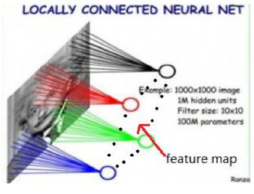
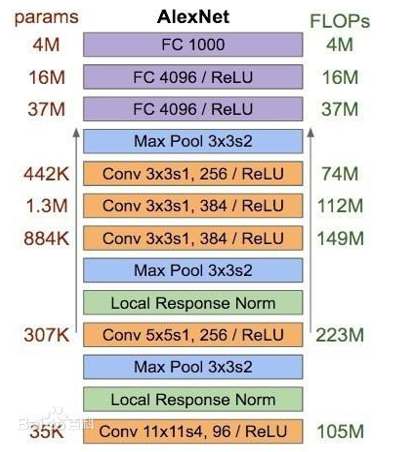
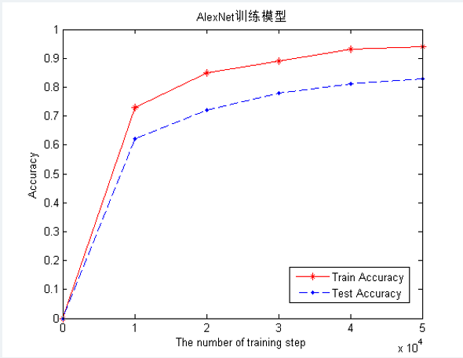
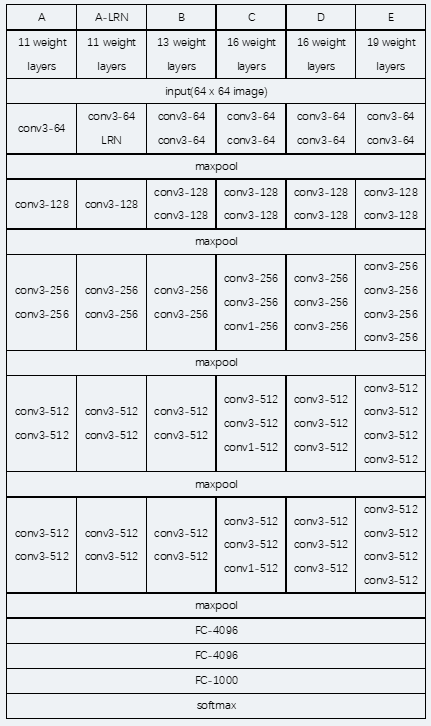
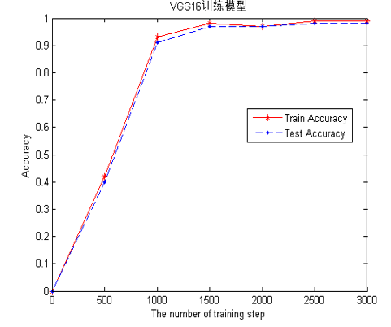
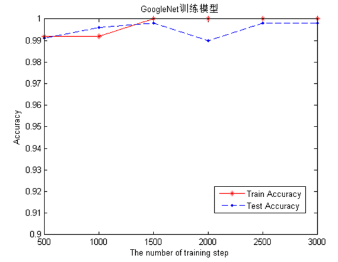

# Deep-learning-for-manwen-recognition

## Description

For the word image data of multiple fonts in the Manchu data set (666 categories), AlexNet, VGG19, GoogLeNet classic deep neural networks are used to realize Manchu word recognition and visual analysis.

## Requirements

- Python >= `3.5`
- `tensorflow` >= `1.0.0`
- `sklearn`
- `numpy`
- `os`
- `PIL`

## Implementations

Based on three classic deep neural networks:
- `AlexNet`
- `VGGNet`
- `GoogLeNet`

### Network Graph & Results

The following is the structure of three neural networks and the results of model training.

#### Alexnet

The network convolution layer is five layers, and the last layer is a softmax layer with 666 categries for classification. The optimizer chooses AdadeltaOptimizer, and the learning rate is set to 0.2.

The training of the AlexNet network is 50,000 times. The recognition accuracy of the training set of the model reaches 94%, and the recognition rate of the test set is about 83%.

#### VGG16

The following figure is the neural network structure of VGG16. VGGNet is improved on the basis of AlexNet. The entire network uses the same size of 3×3 convolution kernel size and 2×2 maximum pooling size. 

After training the VGG16 network 3000 times, it can be seen that the training effect of the network in the previous 1000 times is significantly improved, and the accuracy of the training set and the test set is not much different. In the end, the recognition accuracy of the network on the training and test sets of Manchu words reached 99% and 98%, respectively.

#### GoogleNet

The entire Inception (also known as GoogleNet) structure is composed of multiple inception modules connected in series. The network removes the last fully connected layer and replaces it with a global average pooling layer (that is, changing the image size by 1×1).

After training the network 3000 times, you can see that the Inception V1 network has a very good effect on Manchu word recognition. The convergence speed of the network is also very fast, and the recognition accuracy rate is more than 99% after 500 trainings. Finally, the recognition accuracy of GoogleNet on the training set and the test set is close to 100%.

